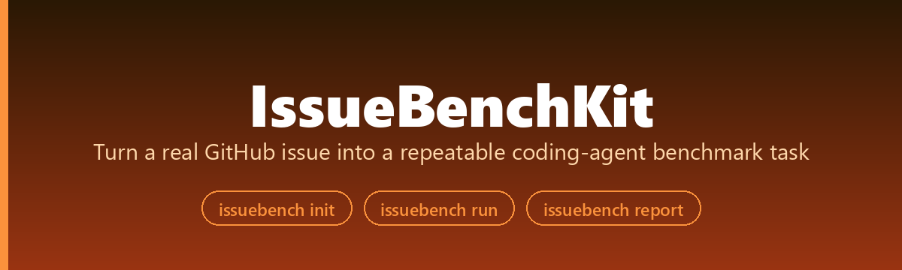
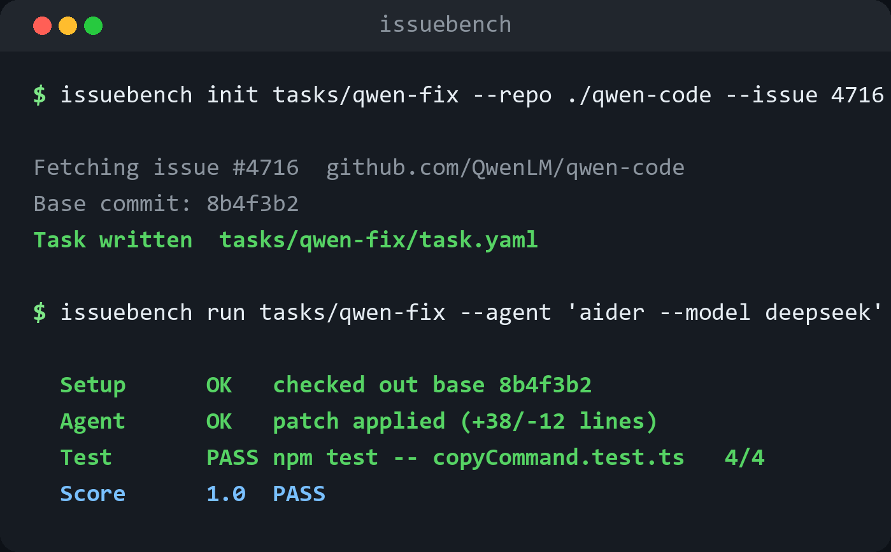

<div align="center">



[](https://pypi.org/project/issuebenchkit/)
[](https://pypi.org/project/issuebenchkit/)
[](LICENSE)

[**快速开始**](#快速开始) · [**工作原理**](#工作原理) · [**评分**](#评分) · [English](README.md)

</div>

<p align="center"></p>

把一个真实 GitHub issue、PR 或本地 bug，打包成可以复现、可以评分、可以分享的 coding-agent benchmark 任务。

公开榜单有 SWE-bench，但真实团队更常遇到的问题是：我想测一个 coding agent 到底能不能修我自己的仓库、我自己的历史 bug、我自己的 CI 失败。靠口头感觉不够，直接把整个项目丢给 Agent 又很难复盘。

IssueBenchKit 做的是更小、更本地、更可控的事情：把一个真实问题整理成任务目录，保存 issue 链接、base commit、验证命令和评分结果。之后你可以让不同 coding agent 修同一个任务，再用同一条命令判断是否真的修好。

## 它解决什么痛点

很多 coding agent demo 看起来很强，但真正落到项目里会遇到三个问题：

- 任务描述不稳定：今天这样说，明天那样说，结果不好比较。
- 验证不稳定：有时只看 diff，有时只跑一部分测试，很难判断是否真的修复。
- 证据不完整：修好还是没修好，最后只剩聊天记录和零散命令。

IssueBenchKit 把这些东西压成一个简单的任务包。任务包不替你自动写测试，但会强制你把“怎么复现、怎么验证、怎么评分”写清楚。

## 快速开始

```bash
pip install issuebenchkit
```

创建一个任务：

```bash
issuebench init tasks/qwen-copy \
  --repo ./qwen-code \
  --issue https://github.com/QwenLM/qwen-code/issues/4716 \
  --base 8b4f3b2 \
  --test "npm test -- copyCommand.test.ts"
```

也可以先生成可运行 demo：

```bash
issuebench demo demo-task
issuebench run demo-task/task --repo demo-task/buggy_repo --out before.json
issuebench run demo-task/task --repo demo-task/fixed_repo --out after.json
issuebench score demo-task/task --before before.json --after after.json
issuebench validate demo-task/task --before-repo demo-task/buggy_repo --after-repo demo-task/fixed_repo --out validation.md
```

内置 demo 不只是一个 Python 玩具例子：

```bash
issuebench demo demo-python --kind python
issuebench demo demo-js --kind javascript
issuebench demo demo-mcp --kind mcp-pr
issuebench demo demo-gallery --all
```

- `python`：一个 pytest 版除零行为 bug。
- `javascript`：一个 Node slugify bug，会错误丢掉版本号里的数字。
- `mcp-pr`：从用户真实开源贡献中提炼的 MCP duplicate initialize 协议任务。

对候选修复运行验证：

```bash
issuebench run tasks/qwen-copy --repo ./candidate-qwen-code --out after.json
```

比较 before / after：

```bash
issuebench score tasks/qwen-copy --before before.json --after after.json
```

导出报告：

```bash
issuebench export tasks/qwen-copy --format html --out report.html
```

导出给 coding agent 看的任务上下文：

```bash
issuebench context tasks/qwen-copy --result after.json --out qwen-copy-context.md
patchcontext scan --repo ./qwen-code --issue qwen-copy-context.md
```

`context` 命令会把任务约束、验证命令、notes 和可选的运行结果整理成 Markdown。它适合作为第一轮提示词材料，也可以交给 PatchContext 继续筛选最相关的代码文件。

## 适合谁

- 想给 coding agent 做私有题库的工程师
- 想把历史 bug 变成回归测试任务的团队
- 想比较多个 Agent / 模型 / prompt 是否真的能修 bug 的开发者
- 做开源贡献时，想把复现和验证证据整理清楚的人

## 当前边界

第一版只做稳定的 MVP：

- 通用 shell 验证命令
- 内置 Python、JavaScript、真实 MCP PR 提炼版 demo workspace
- `issuebench.json` 任务清单
- before / after 评分
- `validate` 任务质量门禁：证明 before 失败、after 通过，并确认两边使用同一条任务命令
- JSONL 和单文件 HTML 报告
- 给 coding agent / PatchContext 用的 Markdown 任务上下文

它不会自动生成测试，也不会自动修改你的仓库。这个边界是故意保留的：benchmark 最重要的是可信，而不是看起来很“自动化”。

## 一句话传播

把你的真实 bug 变成一个小型 SWE-bench。

## License

MIT
